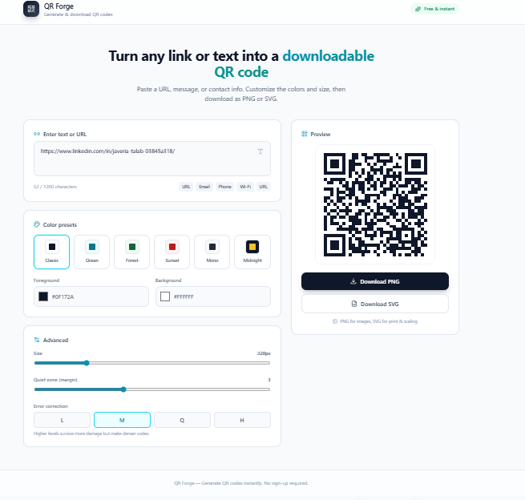

# QR Forge

A modern and user-friendly **QR Code Generator** built for quickly converting URLs, text, contact information, and other content into downloadable QR codes.

## ✨ Features

* 🔗 Generate QR codes from URLs and text
* 📧 Support for email information
* 📱 Support for phone numbers
* 📶 Wi-Fi QR code generation
* 🎨 Multiple QR color presets
* 👀 Real-time QR code preview
* 📥 Download generated QR codes
* 🖼️ Support for PNG/SVG export
* 📊 Character counter
* 📱 Responsive and clean user interface

## 🛠️ Tech Stack

* React.js
* TypeScript
* Vite
* Tailwind CSS
* QR Code generation library
* Lucide React Icons

## 🚀 Getting Started

Clone the repository and install the dependencies:

```bash
git clone https://github.com/JAVERIA-TALAB9/QR-Forge.git
cd QR-Forge
npm install
```

```

Start the development server:

npm run dev
```

Open the local development URL shown in your terminal.

## 🎯 Purpose

QR Forge was created as a simple, fast, and visually appealing tool for generating QR codes without complicated setup. Users can enter their content, customize the appearance, preview the result, and download the QR code for use anywhere.

## 📸 Preview

screenshot of the application:




## 👩‍💻 Author

**Javeria Talab**

Computer Science Student & Full Stack Developer

## 📄 License

This project is available for educational and personal use.
